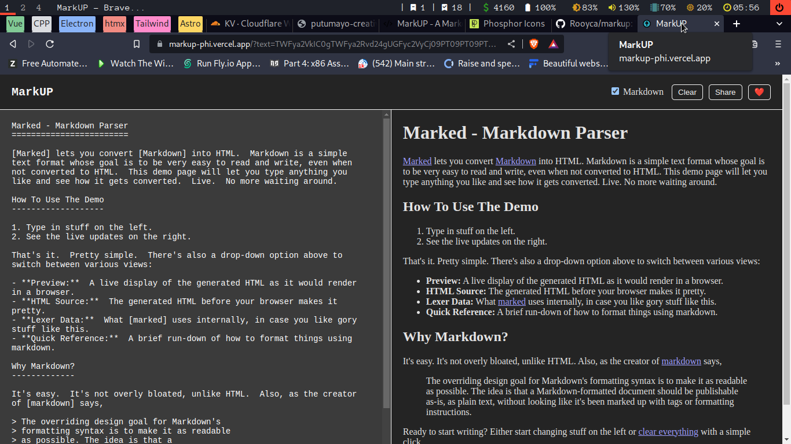

# MarkUP - Markdown Parser

## 🚀 Features

- [x] Easy to use
- [x] Lightweight
- [x] Easy to share

---

## 🧪 Demo

- [Live Demo](https://markup-phi.vercel.app/)
- [Shareable Link](https://is.gd/zqid4a)

---

## 🪧 Usage

There are two options that can be added to the URL:

- `text` - The text to be parsed (`text` must be encoded with base64)
- `showmarkdown` - Show the markdown text (if not pressent or equals to `true` the Markdown will be shown)

---

**Check how short urls are created [here](api/main.py).**

## ✅ TODO

- [x] Shorter links
- [x] Add block code support (... not really)
- [ ] Better UI

---

## 📝 License

- GitHub: [MIT](LICENSE)